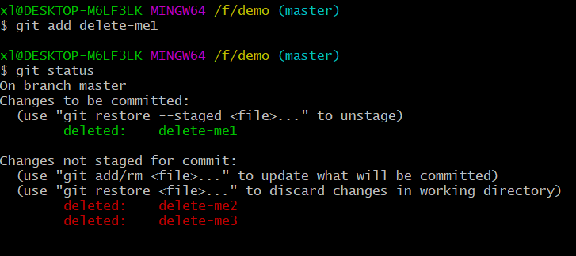

# git 笔记

[toc]

### 1. git 下载安装

没啥好说

### 2. git 配置用户名和邮箱

- 添加全局配置

&emsp;&emsp;`shell`指令：

```shell
git config --global user.name "用户名"
git config --global user.email "邮箱"
```

这样，当我们将代码提交到远端仓库时，后者就会记录提交方的用户名和邮箱，所以用户名和邮箱最好是和我们在代码托管平台 ( 如 github ) 上面的一致。

-添加局部配置
&emsp;&emsp;在本地仓库的根目录下执行下面的`shell`指令：

```shell
git config user.name "用户名"
git config user.email "邮箱"
```

当我们有用户名和邮箱全局配置时，后面又需要将本地仓库提交到另一个代码托管平台 ( `github`、`gitee`、自搭建的`gitlab`等等 )，在另一个代码托管平台上，我们有不同的用户名和邮箱，此时就需要进行局部配置。也就是，局部配置的优先级要高于全局配置。

### 3. git 仓库初始化

&emsp;&emsp;当我们想要将某个文件目录以及目录下的所有文件或文件夹交由 git 管理，需要在这个目录下执行如下`shell`指令：

```shell
git init
```

这样，我们就拥有了一个本地仓库，仓库名就是当前所在文件夹的名字，比如如果在目录`/f/demo`目录下执行了`git init`，那么我们就有了一个名为`demo`的本地仓库：


但这仅仅是初始化，也许这个目录下有文件，但是我们的本地仓库还是空的，后面继续介绍下一步怎么做。

### 4. 暂存区概念

&emsp;&emsp;现在我们拥有了一个空的本地仓库，往里面添加文件之前，我们还要熟悉暂存区概念。
&emsp;&emsp;我们在本地仓库目录下(称工作区)做的操作并不能同步到本地仓库里，比如新建了一个文件 newfile.txt，需要使用`git add`指令把新文件添加到暂存区，再使用`git commit`指令，将暂存区内的新文件提交到本地仓库，即：

<center>工作区 -> 暂存区 -> 本地仓库</center>

### 5. 基本指令

##### 5.1 `git add` 与 `git commit`

&emsp;&emsp;`git add`：我们在工作区新建了一个文件或者修改了一个文件的内容或者删除了一个文件，可以通过这个指令将这些**变化**同步到暂存区。
&emsp;&emsp;`git commit`：通过这个指令，将处在暂存区的**变化**同步到本地仓库。
例子：
`#`工作区新建文件`change-me`和`delete-me`：

```shell
echo Change me > change-me
echo Delete me > delete-me
```

执行`git status`，我们可以看到，新建的两个文件是`Untracked files`：

`#`将新建文件添加到缓存区：

```shell
git add change-me delete-me
```

&emsp;或者

```shell
git add .
```

&emsp;或者

```shell
git add -A
```

三个指令都可以将**变化** ( 指相对本地仓库的变化 ) 添加到暂存区，包括新增一个文件、修改一个文件、删除一个文件。第一条指令中后面部分是文件名，多个文件时，文件名之间用空格隔开；第二条指令是将当前目录下的所有**变化**添加到暂存区；第三条指令是将项目中的所有**变化**添加到暂存区。
因为目前只有当前目录下的两个新文件，所以此时三个指令等价，执行`git status`，发现新文件属于`Changes to be committed`：

`#`将新建文件从缓存区添加到本地仓库：

```shell
git commit [文件名] [文件名] -m "提交说明"
```

指令后面可以加上文件名，将暂存区指定的**变化** ( 新文件或修改文件或删除文件 ) 提交到本地仓库，不加文件名，默认将所有变化提交到本地仓库；跟上 `-m` 和提交说明参数，来说明做了哪些更改。我们先只提交`change-me`，之后执行`git status`，看到`Changes to be committed`下没有了`change-me`：

之后我们使用`git commit -m "commit rest files: delete-me"`，将另一个文件提交，再使用`git log --oneline`指令查看上面的两次提交记录：

`#`修改`change-me`的内容并添加到工作区：

```shell
echo something new > change-me
git status
git add change-me
git status
```

两次的`git status`分别得到的结果如下：


上面的`git add change-me`也可以换成`git add .`或`git add -A`。也就是，修改文件和新增文件是类似的处理方式：在工作区添加新文件或修改原有文件，之后先`git add`到暂存区，再`git commit`到本地仓库。想要删除文件则用到的是`git rm`和`git restore`。

##### 5.2 `git rm` 与 `git restore`

&emsp;&emsp;从工作区删除一个文件很简单：`rm 文件名`，或者动动鼠标来删除一个文件。
&emsp;&emsp;使用`git rm 文件名`可以将指定文件从工作区删除并将这个**变化**添加到暂存区。
&emsp;&emsp;使用`git restore --staged 文件名`可以将之前添加到暂存区的关于指定文件的**变化**从暂存区移除。
&emsp;&emsp;使用`git restore 文件名`可以将之前在工作区对指定文件做的**变化**撤销，令其与本地仓库保持一致。

比如，本地仓库有一个文件`delete-me`，
`rm delete-me`是将文件`delete-me`从工作区删除，`git add delete-me`是将这个**变化**添加到暂存区，但是使用`git rm delete-me`就可以实现这两步操作。即

```shell
git rm delete-me
```

等价于

```shell
rm delete-me
git add delete-me
```

而`git restore`是撤销操作，即通过`rm delete-me`指令删除了`delete-me`文件之后又后悔了，可以执行

```shell
git restore delete-me
```

来实现撤销删除。
但如果通过`git rm delete-me`删除了`delete-me`文件之后又后悔了，需要执行

```shell
git restore --staged delete-me
git restore delete-me
```

来实现撤销删除。

下面是多文件删除的例子：
目前本地仓库有文件`delete-me1`、`delete-me2`、`delete-me3`三个文件。

&emsp;&emsp;如果在工作区删除了文件`delete-me`，可以通过`git add .`或`git add -A`指令实现将删除操作同步到暂存区，也可以使用`git add/rm 文件名`将删除操作同步到暂存区。在工作区执行`rm delete-me`，再使用`git status`：

再执行`git add delete-me1`：

再执行`git rm delete-me2`：

再先后执行`git restore --staged .`和`git add .`：

再先后执行`git restore --staged .`和`git add -A`：

可以看出，与增和改类似，删也可以使用`git add 文件名`、`git add .`和`git add -A`，并且多了`git rm 文件名`指令，但注意没有`git rm .`和`git rm -A`指令。

##### 5.3 `git diff`

### 6. 分支管理

### 7. 版本控制

### 8. 远端仓库
