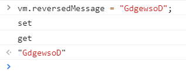
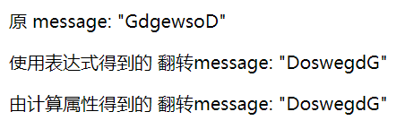
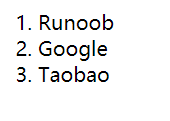
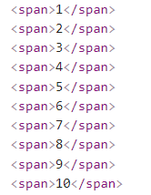

# Vue 笔记

[toc]

### 1.第一个实例

```html
<!DOCTYPE html>
<html>
  <head>
    <meta charset="utf-8" />
    <title>Vue 第一个实例</title>
    <script src="https://unpkg.com/vue/dist/vue.js"></script>
  </head>
  <body>
    <div id="app">
      <p>{{ message }}</p>
    </div>

    <script>
      new Vue({
        el: "#app",
        data: {
          message: "Hello Vue.js!",
        },
      });
    </script>
  </body>
</html>
```

&emsp;&emsp;对`message: 'Hello Vue.js!'`换一种形式(只是让`message`的值看上去高级点):

```html
<script>
  new Vue({
    el: "#app",
    data: {
      message: "页面加载于 " + new Date().toLocaleString(),
    },
  });
</script>
```

### 2. 初识 Vue

- Vue 实例

&emsp;&emsp;通过`new Vue({...})`创建一个 Vue 实例，其中{...}**是**包含如下属性和方法的**对象**(不是全部)：

```js
{
  //属性
  el: "#+div标签id",
  data: {
    key1: value1,
    key2: value2,
    ...
  },
  components: {...},
  methods: {
    function1() {},
    function2() {},
    ...
  },
  watch: {...},
  computed: {...},
  filters: {...},
  //方法
  data() {...},
  beforeCreate() {...},
  created() {...},
  beforeMounted() {...},
  mounted() {...},
  beforeUpdate() {...},
  update() {...},
  beforeDestroyed() {...},
  destroyed() {...}
}
```

- el 属性

&emsp;&emsp;el 属性是 string 型变量，值为`#+div标签id`，表示 Vue 实例的控制范围，在“**第一个实例**”中，Vue 实例在 id 为 app 的 div 标签内有效。

- data 属性

&emsp;&emsp;data 属性是一个对象，对象包含一个或多个属性，在 Vue 实例的有效范围内通过属性名使用。使用方式：

```html
<!-- 方式1 通过{{}} -->
{{ key1 }}
<!-- 方式2 通过一些v-指令，如v-bind -->
<p v-bind:title="key1">鼠标悬停在此处查看效果</p>
```

&emsp;&emsp;data 属性对象内的属性在 Vue 内部的其他属性和方法内可以通过`this.属性名`进行引用和赋值操作。

### 3. 基础

#### 3.1 模板语法

> Vue 使用了基于 HTML 的模板语法，允许开发者声明式地将 DOM 绑定至底层 Vue 实例的数据。

- 插文本：`{{}}`
  数据绑定最常见的形式就是使用“Mustache”语法 (双大括号) 的文本插值，如在**第一个实例**中：

```js
<div id="app">
  <p>{{ message }}</p>
</div>

<script>
  new Vue({
    el: "#app",
    data: {
      message: "Hello Vue.js!",
    },
  });
</script>
```

&emsp;&emsp;例中，`{{ message }}`会被渲染为 vue 实例中的 data 对象下的 message 的属性值，若 message 的属性值发生变化，`{{ message }}`的内容会同步变化。
&emsp;&emsp;但如果`{{ message }}`所属标签有`v-once`指令，则 message 的属性值发生变化，`{{ message }}`的内容不会再变化：

```js
<div id="app">
  <p>{{message}}</p>
  <p v-once>v-once:{{ message }}</p>
</div>
<script>
  let vm = new Vue({
    el: "#app",
    data: {
      message: "Hello Vue.js!",
    },
  });
</script>
```

- 插原生 html

&emsp;&emsp;使用`{{}}`只能插入文本，若需要向 DOM 插入原生 html，则需要在标签内用`v-html`指令，如：

```js
<div id="app">
  <p>Using mustaches: {{ rawHtml }}</p>
  <p>Using v-html directive: <span v-html="rawHtml"></span></p>
</div>
<script>
  let myApp = new Vue({
    el: "#app",
    data: {
      rawHtml: '<span style="color:red">This should be red.</span>'
    }
  })
</script>
```

- 使用 v-bind

&emsp;&emsp;`v-bind`指令是将 data 对象中的属性绑定到标签属性，作为标签属性的值，如：

```js
<div id="app">
  <span v-bind:title="tip">鼠标悬停在此处查看效果</span>
  <br />
  <span v-bind:title="number * 5">数值型演示</span>
  <br />
  <span v-bind:title="isA">布尔型演示</span>
  <br />
  <span v-bind:title="'提示：' + tip + ' 数字2的5倍：' + number*5 + ' 布尔值：' + isA">综合演示</span>
</div>
<script>
  let myApp = new Vue({
    el: "#app",
    data: {
      tip: '我是提示, 看到了吗',
      number: 2,
      isA: true
    }
  })
</script>
```

例中，title 是`<span>`标签的属性，当鼠标悬停在该标签上时，会显示该属性的属性值。再如：

```js
<div id="app">
  <button v-bind:disabled="isButtonDisabled">Button</button>
</div>
<script>
  let myApp = new Vue({
    el: "#app",
    data: {
      isButtonDisabled: true
    }
  })
</script>
```

例中，disabled 是`<buttton>`标签的属性，属性值为 true 时，按钮不可点击，默认为 false。

- 使用`JavaScript`表达式

&emsp;&emsp;实际上，无论是使用`{{}}`插入文本，还是使用`v-html`指令插入原生 html 代码，或者使用`v-bind`指令将底层 Vue 实例的数据与 DOM 标签中的属性绑定，都可以使用`JavaScript`表达式，如：

```js
<div id="app">
  {{ number + 1 }}

  {{ ok ? "YES" : "NO" }}

  {{ message.split("").reverse().join("") }}

  <div v-bind:id="'list-' + id"></div>
</div>
```

例中，`number`、`ok`、`message`都是底层 Vue 实例的数据：

```js
new Vue({
  el: "#app",
  data: {
    number: 9,
    ok: false,
    message: AbcDegeFi,
  },
});
```

#### 3.2 指令

&emsp;&emsp;指令 (Directives) 是带有 v- 前缀的特殊 attribute。指令 attribute 的值预期是单个 JavaScript 表达式 。指令的职责是，当表达式的值改变时，将其产生的连带影响，响应式地作用于 DOM。在前面我们已经见过一些指令了：`v-once`、`v-html`和`v-bind`，这里介绍这些指令的特点。
&emsp;&emsp;**指令参数与指令修饰符**
&emsp;&emsp;指令可以看做标签的属性，和一般的属性不同，指令可以有参数和修饰符，即：`v-xxx` `:参数` `.修饰符`，其中参数是标签的某个属性，若想动态地确定是哪个属性，可使用`:[参数变量]`，通过对参数变量赋值成某个具体属性名来确定参数；修饰符在后面遇到时再说。前面出现的`v-bind:title`、`v-bind:disabled`和`v-bind:id`均是**指令+参数**形式；前面出现的`v-once`和`v-html`均没有参数和修饰符。
&emsp;&emsp;**指令缩写**
&emsp;&emsp;`v-bind`指令和`v-on`指令(后面作介绍)都需要提供参数，并且这两个指令有简写形式：

- `v-bind:参数` 简写为 `:参数`
- `v-on:参数` 简写为 `@参数`

&emsp;&emsp;后面的笔记中会出现更多的指令。

#### 3.3 计算属性

&emsp;&emsp;先看一个例子：

```js
<div id="app">
  <p>Original message: "{{ message }}"</p>
  <p>使用表达式得到的 翻转message: "{{ message.split('').reverse().join('') }}"</p>
  <p>由计算属性得到的 翻转message: "{{ reversedMessage }}"</p>
</div>
```

```js
let vm = new Vue({
  el: "#app",
  data: {
    message: "Hello",
  },
  computed: {
    // 计算属性的 getter
    reversedMessage() {
      // `this` 指向 vm 实例
      return this.message.split("").reverse().join("");
    },
  },
});
```

例中，在 vue 实例中的`computed`对象里定义了一个`reversedMessage`方法，在模板中通过对该方法的调用，得到与在模板中使用一个复杂的表达式(例中第二个`<p>`标签中的内容)同样的效果，简单理解为这是一种封装，使得模板中的代码可读性更高。

&emsp;&emsp;分析例中代码，在`computed`对象中可以直接使用`data`对象中定义的数据，实际上`data`对象中的数据是属于 vue 实例的，即在 vue 实例中的其他地方也可以使用`this.数据名`来读写`data`对象中定义的数据。

&emsp;&emsp;从计算属性的字面理解上，我们应该是在学习一个新的属性，但是现在面对的是一个方法(`reversedMessage()`)，实际上，`reversedMessage`的确只是一个属性，一个含有两个方法的对象：

```js
computed: {
  reversedMessage: {
    get: function () {
      console.log("get");
      return this.message.split("").reverse().join("");
    },
    set: function (val) {
      console.log("set");
      this.message = val;
    }
  }
}
```

例中，当 message 的值发生改变时，set 方法会触发执行，比如我们在浏览器控制台执行`vm.reversedMessage = "GdgewsoD";`，控制台会先后打印`set`和`get`：


根据`reversedMessage`的 set 方法，上面的命令执行后`message`被赋值为`reversedMessage`的新值`GdgewsoD`,之后 get 方法会触发执行，将`reversedMessage`赋值为`DoswegdG`，所以模板会更新为：


#### 3.4 Class 与 Style 绑定

- 对象语法

&emsp;&emsp;我们可以传给 v-bind:class 一个对象，以动态地切换 class：

```html
<div v-bind:class="{ active: isActive }"></div>
```

例中，v-bind 与 class 属性绑定，v-bind 的属性值是一个对象，若`isActive`是 true，则模板会被渲染为`<div class="active"></div>`，再如，若有多个 class 样式：

```html
<div
  class="static"
  v-bind:class="{ active: isActive, 'text-danger': hasError }"
></div>
```

例中，若`isActive`是 true，`hasError`是 false，则模板会被渲染为`<div class="static active"></div>`。

&emsp;&emsp;我们还可以将 v-bind 的属性值，即一个对象，整体放到 vue 实例的 data 对象内，如：

```html
<div class="static" v-bind:class="classObject"></div>
```

```js
data: {
  classObject: {
    active: true,
    'text-danger': false
  }
}
```

&emsp;&emsp;我们也可以使用一个返回对象的计算属性达到同样的效果：

```html
<div class="static" v-bind:class="classObject"></div>
```

```js
data: {
  isActive: true,
  error: null
},
computed: {
  classObject() {
    return {
      active: this.isActive && !this.error,
      'text-danger': this.error && this.error.type === 'fatal'
    }
  }
}
```

- 数组语法

&emsp;&emsp;除了将一个对象传给`v-bind:class`外，还可以使用数组：

```html
<div v-bind:class="[activeClass, errorClass]"></div>
```

```js
data: {
  activeClass: 'active',
  errorClass: 'text-danger'
}
```

&emsp;&emsp;同样我们也可以将数组抽出放入 Vue 实例的 data 对象里：

```html
<div v-bind:class="classArray"></div>
```

```js
data: {
  classArray: ["active", "text-danger"];
}
```

&emsp;&emsp;我们也可以同时使用对象语法和数组语法：

```html
<div v-bind:class="[{ active: isActive }, errorClass]"></div>
```

```js
data: {
  isActive: true,
  errorClass: 'text-danger'
}
```

#### 3.5 条件渲染

- v-if / v-else / v-else-if

&emsp;&emsp;用于条件判断，`v-if`/`v-else`/`v-else-if`参数和修饰符，属性值必须是 true 或 false 或条件表达式。v-else-if 不需要提供属性值。例：

```js
<div id="app">
  <div v-if="type === 'A'">A</div>
  <div v-else-if="type === 'B'">B</div>
  <div v-else-if="type === 'C'">C</div>
  <div v-else>Not A/B/C</div>

  <div v-if="isTrue">true</div>
</div>
<script>
  let myApp = new Vue({
    el: "#app",
    data: {
      type: 'C',
      isTrue: true
    }
  })
</script>
```

&emsp;&emsp;如果`v-if`系列指令用在`<template>`上，则渲染后不会包含`<template>`标签对。

- 使用 key 属性

&emsp;&emsp;现分析系统登录方式切换，假设系统提供了邮箱登录和手机号登录：

```html
<template v-if="loginType === 'email'">
  <label>Email</label>
  <input placeholder="Enter your email address" />
</template>
<template v-else>
  <label>Phone</label>
  <input placeholder="Enter your phone number" />
</template>
```

&emsp;&emsp;默认情况下，我们切换登录方式时，如果我们在输入框已经输入了一些内容，切换登录方式会保留输入框中我们输入的内容(比如，我们输入了手机号，发现当前的登录方式是邮箱登录，需要切换为手机号登录)。但是有些时候我们并不想让输入框的内容在切换时保留，可以使用`<input>`标签的 key 属性：

```html
<template v-if="loginType === 'email'">
  <label>Email</label>
  <input placeholder="Enter your email address" key="username-input" />
</template>
<template v-else>
  <label>Phone</label>
  <input placeholder="Enter your phone number" key="email-input" />
</template>
```

&emsp;&emsp;只要`<input>`标签的 key 属性的值不同，就可以实现不保留输入框内容。

- v-show

&emsp;&emsp;标签使用`v-show`指令后，经过渲染，无论值是 true 还是 false，都会保留在 DOM 中，只是标签的`display`的值有所不同：

```html
<h1 v-show="ok">Hello!</h1>
<h1 v-show="!ok">Hello!</h1>
```

```js
data: {
  ok: false;
}
```

&emsp;&emsp;模板将被渲染为：

```html
<h1 style="display: none;">Hello! This is ok!</h1>
<h1>Hello! This is not ok!</h1>
```

&emsp;&emsp;需要注意`v-show`不支持`<template>`标签。

&emsp;&emsp;还需要注意，一般来说，`v-if` 有更高的切换开销，而 `v-show` 有更高的初始渲染开销。因此，如果需要非常频繁地切换，则使用 `v-show` 较好；如果在运行时条件很少改变，则使用 `v-if` 较好。

#### 3.6 列表渲染

- v-for 与数组

&emsp;&emsp;我们可以用 v-for 指令基于一个数组来渲染一个列表。`v-for`没有参数和修饰符，属性值的形式为`a in A`，其中 A 是在 data 对象内定义的数组；a 是一个自定义变量，可在标签内使用，代表数组的一个元素。`v-for`常用在列表中，相应的数据存放在一个数组变量中。例：

```html
<div id="app">
  <ol>
    <li v-for="site in sites" :key="site.name">{{ site.name }}</li>
  </ol>
</div>
```

```js
<script>
  new Vue({
    el: '#app',
    data: {
      sites: [
        { name: 'Runoob' },
        { name: 'Google' },
        { name: 'Taobao' }
      ]
    }
  })
</script>
```

例中，`sites` 是一个有三个元素的数组变量，每个元素是一个有 `name` 属性的对象。经过渲染，我们可以得到一个列表：

&emsp;&emsp;我们可以在`v-for`指令的属性值中使用索引参数：

```html
<li v-for="(site, index) in sites" :key="index">{{ site.name }}</li>
```

&emsp;&emsp;我们还可以将属性值中的`in`换做`of`：

```html
<li v-for="(site, index) of sites" :key="index">{{ site.name }}</li>
```

- v-for 与对象

&emsp;&emsp;除了列表，我们还可以用 v-for 指令基于一个对象来渲染一个列表：

```html
<ul>
  <li v-for="value in object">{{ value }}</li>
</ul>
```

```js
data: {
  object: {
    title: 'How to do lists in Vue',
    author: 'Jane Doe',
    publishedAt: '2016-04-10'
  }
}
```

&emsp;&emsp;我们还可以使用第二个参数和第三个参数分别代表键名和索引：

```html
<div v-for="(value, name, index) in object">
  {{ index }}. {{ name }}: {{ value }}
</div>
```

- v-for 与数值

&emsp;&emsp;直接看例子：

```html
<span v-for="n in 10">{{ n }} </span>
```

&emsp;&emsp;渲染结果：


#### 3.7 事件处理

- v-on 与监听事件

&emsp;&emsp;我们可以用 v-on 指令监听 DOM 事件，并在触发时运行一些 JavaScript 代码：

```html
<div id="app">
  <button v-on:click="counter += 1">Add 1</button>
  <p>The button above has been clicked {{ counter }} times.</p>
</div>
```

```js
let vm = new Vue({
  el: "#app",
  data: {
    counter: 0,
  },
});
```

例中，我们使用了`v-on`指令，指令的参数是`click`，当我们点击按钮时，指令的属性值会被触发执行，即`counter += 1`会被执行，counter 的值会增加 1。

&emsp;&emsp;当我们希望点击按钮后执行复杂的逻辑，上面的方式就无法实现了。我们可以将点击按钮后将被执行的代码提取至一个函数中，在原处留下一个函数名，这样我们就可以定义复杂的操作了：

```html
<div id="app">
  <!-- `greet` 是在下面定义的方法名 -->
  <button v-on:click="greet">Greet</button>
  <br />
  <button v-on:click="greet()">Greet()</button>
  <br />
  <button v-on:click="greet(event)">Greet(event)</button>
  <br />
  <button v-on:click="greet('event')">Greet(event)</button>
  <br />
  <button v-on:click="greet($event)">Greet($event)</button>
</div>
```

```js
let vm = new Vue({
  el: "#app",
  data: {
    name: "Vue.js",
  },
  // 在 `methods` 对象中定义方法
  methods: {
    greet(event) {
      // `this` 在方法里指向当前 Vue 实例
      alert("Hello " + this.name + "!");
      // `event` 是原生 DOM 事件
      if (event) {
        alert(event.target.tagName);
      }
    },
  },
});
```

例中，我们分别使用了`greet`、`greet()`、`greet(event)`、`greet('event')`和`greet($event)`作为`v-on`指令的属性值，其中`greet`和`greet($event)`是等价的，`greet(event)`和`greet('event')`会报错。

- v-on 与事件修饰符

&emsp;&emsp;前面提到过，有些指令可以有参数和修饰符，即`v-xxx:参数.修饰符`，这里就介绍修饰符。修饰符包括：`.stop` `.prevent` `.capture` `.self` `.once` `.passive`。具体介绍:

```html
<!-- 阻止单击事件继续传播 -->
<a v-on:click.stop="doThis"></a>
```

```html
<!-- 提交事件不再重载页面 -->
<form v-on:submit.prevent="onSubmit"></form>
```

```html
<!-- 修饰符可以串联 -->
<a v-on:click.stop.prevent="doThat"></a>
```

```html
<!-- 添加事件监听器时使用事件捕获模式 -->
<!-- 即内部元素触发的事件先在此处理，然后才交由内部元素进行处理 -->
<div v-on:click.capture="doThis">...</div>
```

```html
<!-- 只当在 event.target 是当前元素自身时触发处理函数 -->
<!-- 即事件不是从内部元素触发的 -->
<div v-on:click.self="doThat">...</div>
```

注：使用修饰符时，顺序很重要；相应的代码会以同样的顺序产生。因此，用 `v-on:click.prevent.self` 会阻止所有的点击，而 `v-on:click.self.prevent` 只会阻止对元素自身的点击。

```html
<!-- 点击事件将只会触发一次 -->
<a v-on:click.once="doThis"></a>
```

```html
<!-- 滚动事件的默认行为 (即滚动行为) 将会立即触发 -->
<!-- 而不会等待 `onScroll` 完成  -->
<!-- 这其中包含 `event.preventDefault()` 的情况 -->
<div v-on:scroll.passive="onScroll">...</div>
```

```html
<!-- 只有在 `key` 是 `Enter` 时调用 `vm.submit()` -->
<input v-on:keyup.enter="submit" />
<!-- 只有在 `key` 是 `PageDown` 时调用 `vm.onPageDown()` -->
<input v-on:keyup.page-down="onPageDown" />
```

#### 3.8 表单输入绑定

- v-model 与双向数据绑定

&emsp;&emsp;`v-model`用于数据双向绑定，一方数据改变，另一方也随之同步改变。一般在表单 `<input>`、`<textarea>` 及 `<select>` 元素上创建双向数据绑定。如：

```html
<div id="app">
  <div id="example-1">
    文本：
    <br />
    <input v-model="message" placeholder="edit me" />
    <hr />
  </div>
  <div id="example-2">
    多行文本：
    <br />
    <textarea v-model="message" placeholder="add multiple lines"></textarea>
    <br />
    <span>Message is: {{ message }}</span>
    <hr />
  </div>
  <div id="example-3">
    复选框(单个)：
    <br />
    <input type="checkbox" id="checkbox" v-model="checked" />
    <label for="checkbox">{{ checked }}</label>
    <br />
    复选框(多个)：
    <br />
    <input type="checkbox" id="jack" value="Jack" v-model="checkedNames" />
    <label for="jack">Jack</label>
    <input type="checkbox" id="john" value="John" v-model="checkedNames" />
    <label for="john">John</label>
    <input type="checkbox" id="mike" value="Mike" v-model="checkedNames" />
    <label for="mike">Mike</label>
    <br />
    <span>Checked names: {{ checkedNames }}</span>
    <hr />
  </div>
  <div id="example-4">
    单选按钮：
    <br />
    <input type="radio" id="one" value="One" v-model="picked" />
    <label for="one">One</label>
    <br />
    <input type="radio" id="two" value="Two" v-model="picked" />
    <label for="two">Two</label>
    <br />
    <span>Picked: {{ picked }}</span>
    <hr />
  </div>
  <div id="example-5">
    选择框(单选)：
    <br />
    <select v-model="selected">
      <option disabled value="">请选择</option>
      <option>A</option>
      <option>B</option>
      <option>C</option>
    </select>
    <span>Selected: {{ selected }}</span>
    <br />
    选择框(多选)：
    <select v-model="choosed" multiple style="width: 50px;">
      <option>A</option>
      <option>B</option>
      <option>C</option>
    </select>
    <br />
    <span>Choosed: {{ choosed }}</span>
    <hr />
  </div>
</div>
```

```js
new Vue({
  el: "#app",
  data: {
    message: "",
    checked: false,
    checkedNames: ["John"],
    picked: "One",
    selected: "B",
    choosed: ["C"],
  },
});
```

- v-model 与修饰符

&emsp;&emsp;`.lazy`修饰符
&emsp;&emsp;在默认情况下，v-model 在每次 input 事件触发后将输入框的值与数据进行同步 (除了上述输入法组合文字时)。你可以添加 lazy 修饰符，从而转为在 change 事件**之后**进行同步：

```html
<div id="app">
  <!-- 在“change”时而非“input”时更新 -->
  <input v-model.lazy="msg" />
  {{msg}}
</div>
```

&emsp;&emsp;`.number`修饰符
&emsp;&emsp;如果想自动将用户的输入值转为数值类型，可以给 v-model 添加 number 修饰符：

```html
<input v-model.number="age" type="number" />
```

这通常很有用，因为即使在 type="number" 时，HTML 输入元素的值也总会返回字符串。如果这个值无法被 parseFloat() 解析，则会返回原始的值。

&emsp;&emsp;`.trim`修饰符
&emsp;&emsp;如果要自动过滤用户输入的首尾空白字符，可以给 v-model 添加 trim 修饰符：

```html
<div id="app">
  <!-- 在“change”时而非“input”时更新 -->
  <input v-model.trim="msg" />
  {{msg}}
</div>
```

### 4. 组件

#### 4.1 一个例子

&emsp;&emsp;在 js 脚本中这样定义组件：

```js
Vue.component("button-counter", {
  data() {
    return {
      count: 0,
    };
  },
  template:
    '<button v-on:click="count++">You clicked me {{ count }} times.</button>',
});
```

这样，我们就注册了一个全局组件(相对的，也有局部组件的注册，在后面)，component 方法的第一个参数是组件的名称，第二个参数是一个定义组件具体内容的对象，在这个例中，对象中有一个`data方法`和一个`template属性`。之后我们可以在任何一个 Vue 实例对应的模板中这样使用组件：

```html
<div id="app">
  <button-counter></button-counter>
  <hr />
  <button-counter></button-counter>
</div>
```

模板会被渲染为：

很明显，组件是可以复用的，并且它们彼此互不影响(本例中组件的 count 属性都是独立不相关的)。

#### 4.2 向子组件传递数据

&emsp;&emsp;这里有一个需要接收外面提供数据的组件：

```js
Vue.component("blog-post", {
  props: ["title"],
  template: "<h3>{{ title }}</h3>",
});
```

例中，`blog-post`组件(**子组件**)需要外面提供一个数据作为`title`，如果有多个数据，我们统一在名为`props`的数组内注明。
&emsp;&emsp;在模板中，我们这样使用组件：

```html
<blog-post title="My journey with Vue"></blog-post>
```

我们也可以将`title`的值与 Vue 实例底层绑定：

```html
<div id="app">
  <!-- :title 是 v-bind:title 的缩写 -->
  <blog-post :title="title"></blog-post>
</div>
```

```js
new Vue({
  el: "#app",
  data: {
    title: "My journey with Vue",
  },
});
```

#### 4.3 监听子组件事件

&emsp;&emsp;现在我们来实现点击一个按钮来放大整个页面正文的字号：
`#`组件：

```js
Vue.component("blog-post", {
  props: ["post"],
  template: `
    <div>
      <h3>{{ post.title }}</h3>
      <button>
        Enlarge text
      </button>
      <div v-html="post.content"></div>
    </div>
  `,
});
```

`#`Vue 实例

```js
new Vue({
  el: "#app",
  data: {
    posts: [
      { id: 1, title: "My journey with Vue", content: "content1..." },
      { id: 2, title: "Blogging with Vue", content: "content2..." },
      { id: 3, title: "Why Vue is so fun", content: "content3..." },
    ],
    postFontSize: 1,
  },
});
```

`#`模板

```html
<div id="app" :style="{ fontSize: postFontSize + 'em' }">
  <blog-post v-for="post in posts" :key="post.id" :post="post"></blog-post>
</div>
```

&emsp;&emsp;以上只是准备工作，我们还未实现最初设想的功能，现在才正式开始，需要修改两处：
`#`修改组件：

```js
Vue.component("blog-post", {
  props: ["post"],
  template: `
        <div>
          ...
          <button @click="$emit('enlarge-text')">
            Enlarge text
          </button>
          ...
        </div>
      `,
});
```

`#`修改模板：

```html
<div id="app" :style="{ fontSize: postFontSize + 'em' }">
  <blog-post
    v-for="post in posts"
    :key="post.id"
    :post="post"
    @enlarge-text="postFontSize += 0.1"
  ></blog-post>
</div>
```

例中，我们在组件内的`<button>`标签使用`v-on:click`指令(缩写后是`@click`)，指令的属性值用到了`$emit()`方法，方法的参数值作为事件名。通过在组件标签上使用`v-on:事件名`来绑定`<button>`的 click 事件，`v-on:事件名`的值是`<button>`的 click 事件触发后执行的逻辑代码。

#### 4.4 让子组件内的事件抛出一个值

&emsp;&emsp;上面我们实现了监听组件内部事件(`<button>`的 click 事件)并执行相应的代码逻辑(`postFontSize += 0.1`)，现在我们来实现获取组件内部事件抛出的值：
`#`修改组件：

```js
Vue.component("blog-post", {
  props: ["post"],
  template: `
    <div>
      ...
      <button @click="$emit('enlarge-text', 0.1)">
        Enlarge text
      </button>
      ...
    </div>
  `,
});
```

`#`修改模板：

```html
<div id="app" :style="{ fontSize: postFontSize + 'em' }">
  <blog-post
    v-for="post in posts"
    :key="post.id"
    :post="post"
    @enlarge-text="postFontSize += $event"
  ></blog-post>
</div>
```

上面，我们在组件的 template 属性值的`<button>`标签中使用`$emit('事件名', 想要抛出的值)`来实现向外部抛出值；我们又在模板中的`<blog-post>`组件标签中的`@事件名`的属性值中使用`$event`来访问被抛出的值。

&emsp;&emsp;如果我们将`@事件名`的属性值封装到 Vue 实例的方法中，代码可读性会更高，并且可以实现更复杂的逻辑。上面的例子等价于：
`#`修改模板：

```html
<div id="app" :style="{ fontSize: postFontSize + 'em' }">
  <blog-post ... @enlarge-text="onEnlargeText"></blog-post>
</div>
```

`#`Vue 实例的 methods 属性：

```js
methods: {
  onEnlargeText(enlargeAmount) {
    this.postFontSize += enlargeAmount;
  }
}
```

#### 4.5 在组件中使用插槽

&emsp;&emsp;你会发现，上面的组件在模板中使用的过程中，仅仅是`<组件名></组件名>`，标签对之间没有内容。然后是可以有内容，需要这样使用：
`#`组件

```js
Vue.component("alert-box", {
  template: `
    <div>
      <strong>Error!</strong>
      <slot></slot>
    </div>
  `,
});
```

`#`模板

```html
<alert-box> Something bad happened. </alert-box>
```

上面，我们在组件的 template 属性中使用了`<slot>`标签，即插槽。

### 5. 单页面应用与 vue-cli
